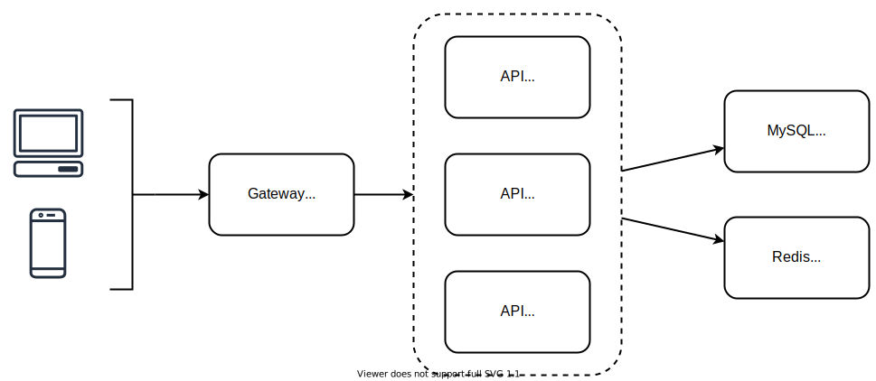

# Subscription Management API Service

An api service for mobile devices to enable "in-app purchases", "confirm purchase order" and "check subscription status". This is for demo purposes and created to demonstrate architectural & programming skills.

## Overview:



- **Nginx Container:** This service will act as an API gateway and Load-Balancer, and it will route all the calls to the appropriate services ie PHP-FPM.
- **PHP-FPM API Containers:** This service will serve all the API related endpoints.
- **MySQL Container:** This database container will store/persists all the data related to devices & subscriptions, hence will be accessed and consumed by php-fpm container.
- **Redis Container:** This will be used to cache the data ie (Subscriptions in our case), to save DB from hitting for all the requests, hence will be accessed and consumed by php-fpm container.

## Installation

Development environment requirements:

- Git
- Docker >= 18

Setting up your machine using setup script **(For MAC/LINUX)**:

```bash
git clone git@github.com:ahsanatiq/subscription-system.git
cd subscription-system
./setup.sh
```

Manual setup **(For Windows)**:

```bash
git clone git@github.com:ahsanatiq/subscription-system.git
cd subscription-system
cp .env.example .env
docker-compose up -d
docker exec -it ahsan-phpfpm-api-1 composer install
docker exec -it ahsan-phpfpm-api-2 composer install
docker exec -it ahsan-phpfpm-api-3 composer install
docker exec -it ahsan-mysql mysql -u root -pteknasyon -e "create database teknasyon_testing; GRANT ALL PRIVILEGES ON *.* TO 'teknasyon'@'%' IDENTIFIED BY 'teknasyon';";
docker exec -it ahsan-phpfpm-api-1 php artisan migrate
docker exec -it ahsan-phpfpm-api-1 php artisan db:seed
```

Now, you can access the service endpoints at http://localhost:8080.

### Run Tests

Run the tests using `phpunit` in the PHP-FPM containers:

```bash
docker exec -it ahsan-phpfpm-api-1 vendor/bin/phpunit
```

### Run Code Linting for Code-Styling

Coding-style standards are defined in the file `./phpcs.xml`. To Run it, use php-code-sniffer `phpcs` for code-linting & check for styling issues:

```bash
docker exec -it ahsan-phpfpm-api-1 vendor/bin/phpcs
```

### API Endpoints

| Method | Endpoint                    | Params                                                                       | Return                                   |
| ------ | --------------------------- | ---------------------------------------------------------------------------- | ---------------------------------------- |
| `POST` | `/v1/device/register`       | `uID` ( string), `appID` (string), `language` (en/fr/ch), `os` (android/ios) | `token` (string)                         |
| `POST` | `/v1/subscription/purchase` | `clientToken` (string), `receipt` (string)                                   | `success` (boolean)                      |
| `POST` | `/v1/subscription/check`    | `clientToken` (string)                                                       | `status`(boolean)                        |
| `POST` | `/platform/android`         | `receipt` (string)                                                           | `success` (boolean), `expiry` (datetime) |
| `POST` | `/platform/ios`             | `receipt` (string)                                                           | `success` (boolean), `expiry` (datetime) |

### Note(s):

- The application is based on [Laravel Lumen Framework](https://lumen.laravel.com/docs/6.x) (6.x LTS version). Used bcoz of its minimalistic nature, hence fast, and also full-filling the requirements to build the API.

- The configurations are stored in the `/config/` directory, and `.env` files.

- All the dependencies of the application are stored in `composer.json` file, which can be installed by `composer install` command.

- Docker is being used to spin-up all the required services / containers. The specs are stored in the `docker-compose.yml`file, and extra docker related scripts are stored in `/docker-scripts/`directory.

- The bash-script `setup.sh`file on the project root, contain all the necessary commands to provision & get up-and-running with setup. 

- The database-schema is stored at `/database/schema/teknasyon__20210203.sql` 

- The `/database/`directory also includes the migration & seeding scripts. 

- The `/routes/api.php` constains all the endpoints. 

- The `/src` directory contains all the application & domain-logic. It is divided into three layers `Application`, `Domain`, `Interfaces`. Hence, following the [Clean-Architecture](https://cdn-images-1.medium.com/max/1600/1*D1EvAeK74Gry46JMZM4oOQ.png)  
  
  - **Domain**: contains all the core-entities & value-objects.
  
  - **Application**: contains all the services/use-cases of our application.
  
  - **Interfaces:**  contains all the UI/Persentation code, that interacts with our application. 

-  The `/tests` contains all the integration-tests, which include all the test-scenerios of our api's


